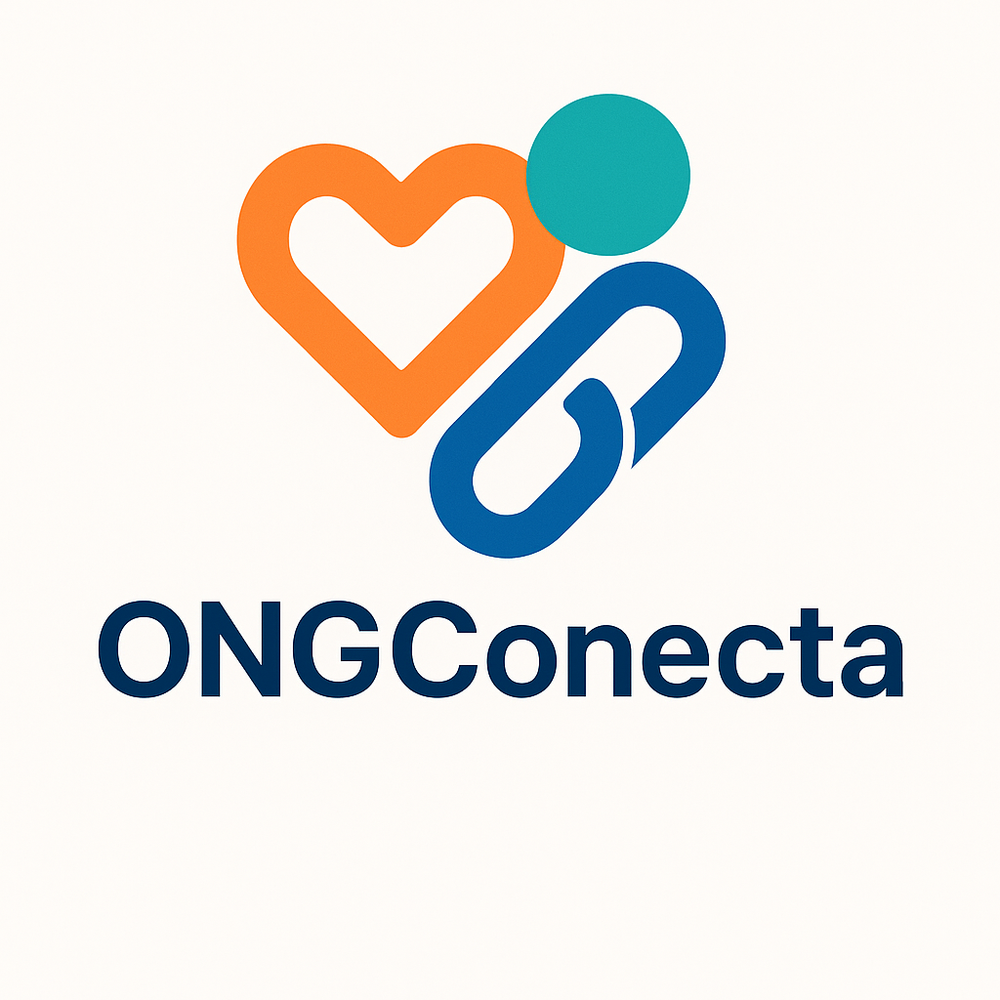

  

O **ONGConecta** é um site simples e responsivo desenvolvido em **HTML5**, com o objetivo de apresentar e divulgar **ONGs parceiras** que atuam em diferentes áreas sociais e ambientais.  
Cada organização é exibida em um **card visual**, com imagem, descrição e link direto para mais informações.

> [! WARNING] ⚠️ Projeto ainda em construção
  Esta aplicação está em fase ativa de desenvolvimento. Funcionalidades podem sofrer alterações.
---

## ✨ Funcionalidades

- [x] Exibição de **cards interativos** com imagem, título, descrição e botão.
- [x] Estrutura organizada de pastas para facilitar manutenção.
- [x] Base pronta para integrar estilos via **CSS** 
- [x] Base com  **JavaScript**.
## ✨ Proximos passos
- [ ] Deploy.

---
